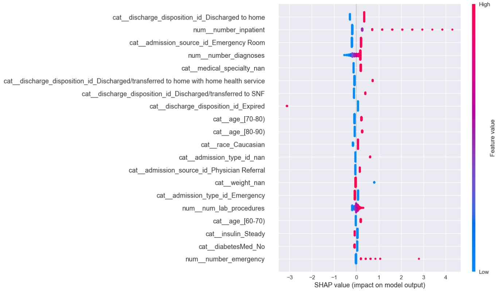

# Diabetes Readmission ML Project

A modular, reproducible xAI project for analysing 30-day readmission risk in diabetic patients, combining interpretable models with clear feature insights 
to support evidence-based operational decisions in clinical settings.

 
  
## Executive Summary

This project develops a fully reproducible machine-learning pipeline for predicting 30-day hospital readmission in diabetic patients
 using the Diabetes 130-US Hospitals dataset. It includes modular preprocessing, ICD-9 feature handling, baseline models, tree-based models, 
 and SHAP explainability. 
 
| Model                | ROC-AUC | PR-AUC | Notes                  |
|----------------------|--------:|-------:|------------------------|
| Logistic Regression  | 0.703   | 0.600  | Best overall, stable   |
| Random Forest        | 0.685   | 0.556  | Overfitting observed   |
| LR + ICD-9 features  | ~0.69   | ~0.58  | No improvement         |

##  Explainability (SHAP)

The logistic regression model was interpreted using SHAP (SHapley Additive exPlanations) to quantify the marginal contribution of each 
variable to the predicted probability of 30-day readmission. 

SHAP provides a consistent, model-agnostic explanation framework that aligns well with the linear structure of logistic regression.


<p align="center">
  
</p>

## Environment Setup

### Using Mamba (recommended)
```bash
mamba env create -f environment.yml
conda activate diabetes-readmission-ml
```
### Verify Package Versions within the Virtual Environment (optional; highly recommended)
```
python scripts/version_check.py
```
This confirms that installed packages match the pinned versions.

### Enable Jupyter Notebook Support (optional; recommended)
```
conda activate diabetes-readmission-ml
mamba install -c conda-forge notebook
python -m pip install ipykernel ipywidget
python -m ipykernel install --user --name diabetes-readmission-ml --display-name "Python (diabetes-readmission-ml)"
jupyter notebook
```
A notebook called version_check.ipynb is provided within notebooks/ and serves as a good starting 
point to verify that your environment is functioning correctly.

### Initial Directory Structure
```
diabetes-readmission-ml/
├── notebooks/
├── src/
├── scripts/
│   └── version_check.py
├── environment.yml
├── requirements.txt
└── README.md
```

### Install Pytest manually (optional; recommended)
```
conda activate diabetes-readmission-ml
mamba install pytest
```

##  Conclusion

### My Modelling Approach
- Examine data first -- specifically, look for missing data, and imbalance in the variable under prediction.
- Standard baseline models first (Logistic Regression, Random Forest).
- Random Forest overfit; raw ICD-9 expansion added no value without clinical grouping.
- SHAP - validates feature importance and plausibility.

### Key Predictors
- Prior inpatient and emergency visits were the strongest indicators of readmission risk.
- Discharge disposition and age bands also predictive .
- ICD-9 codes no use without time-intensive clinical grouping.

### How Hospitals Can Use This
- Identify high-risk patients for careful discharge planning and follow-through (social workers, community support).
- Focus resources to target signatures of patients likely to present for readmission.
- Flag high-risk discharge types (rehab, nursing-home, home-health, AMA) and automatically trigger extra follow-up checks to reduce readmissions.

### Discussion and Limitations

This baseline pipeline highlights the predictive structure of the Diabetes 130-US Hospitals dataset, but also demonstrates domain-specific bottlenecks:

- Sparse, long-tailed ICD-9 codes
- Modest performance ceilings with simple demographic + visit features
- Clear trade-offs between interpretability and expressiveness

These factors illustrate why 30-day readmission remains a challenging predictive task in clinical ML,
and they highlight clear opportunities for future work with more expressive models and richer temporal features.
